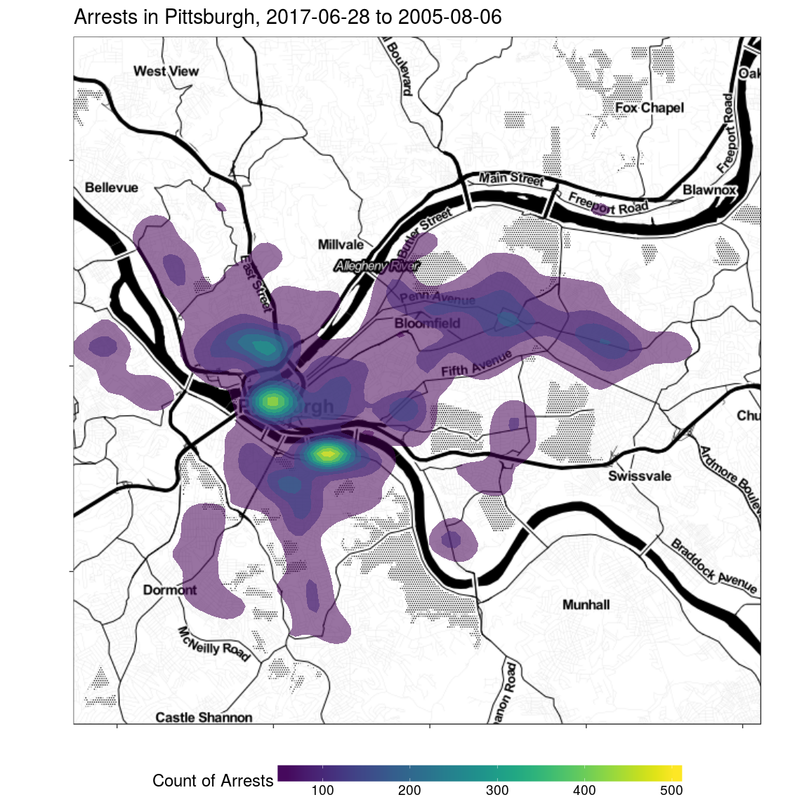

README
================
Conor Tompkins
2/17/2018

pgh-crime
=========

This is a repo for analyzing crime data in Pittsburgh PA

``` r
city_map <-  get_map("North Oakland, Pittsburgh, PA", 
                     zoom = 12,
                     maptype = "toner", 
                     source = "stamen")

city_map <- ggmap(city_map)
```

``` r
#Filter out data that is not in one of the six police zones
df_map <- df %>% 
  filter(zone %in% c(1:6), date >= "2005-01-01")

date_first <- first(df_map$date)
date_last <- last(df_map$date) 

#Put the data on the map
city_map +
  stat_density_2d(data = df_map, #Using a 2d contour
                  aes(x, #longitude
                      y, #latitude
                      fill = ..level.., #Use the count of arrests as the fill
                      alpha = .5), #Use alpha so you can see the map under the data
                  geom = "polygon") + #We want the contour in a polygon
  #facet_wrap(~wday, nrow = 2) +
  scale_fill_viridis() +
  guides(alpha = FALSE,
         fill = guide_colorbar("Count of Arrests")) +
  labs(title = str_c("Arrests in Pittsburgh, ", date_first, "-", date_last),
       x = "",
       y = "") +
  theme(legend.position = "bottom",
        legend.direction = "horizontal",
        axis.text = element_blank())
```


